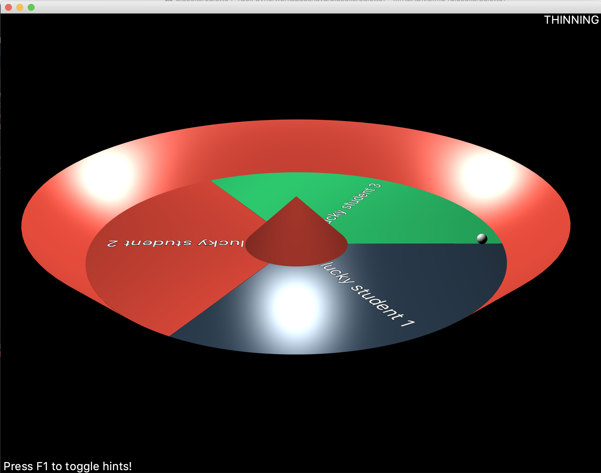

# Gluecksroulette

## Description

The Gluecksroulette (*engl. Roulette of Fortune*) is a product resulting from a university project from 2019.
The basic idea was to create a 3D-version of an existing wheel of Fortune, which allows a professor at the university to randomly select a student of his course.


version 1.0


## Build

You can either download the latest released JAR or build it from source by cloning this repo and running:

```shell
$ mvn package
```


## Run And Have Fun

If you run the JAR, you get something like this:



You can display the help menu by pressing F1.
Furthermore, you can customize the mapped hot keys by modifying the `config.luck`, which is generated at the first program start.
Additionally, you can load different courses (consisting of students/persons), which is explaining in more detail in the following section.


### Course Files

The structure of a course file is as easy as:

```csv
Student[,weight]
```

As you can see, the course files are simple CSV files with the student names and their (optional) weights specified.
You can find an example below.

```csv
Florian Dahlitz
Dominique Lasserre, 0.5
Sebastian Schmitt
Paul Weißer, 1
```


### Configuration

You can customize hot keys and further things in your `config.luck`, which is generated on the first program start.

| Configuration Item | Default Value |
|--------------------|---------------|
| HOTKEY_SPIN | Space |
| WINDOW_HEIGHT | 621 |
| WINDOW_WIDTH | 809 |
| HOTKEY_TOGGLE_HELP | F1 |
| HOTKEY_OPEN_COURSE_FILE | Ctrl O |
| HOTKEY_SOFT_RESET | R |
| HOTKEY_HARD_RESET | Ctrl R |
| HOTKEY_SAVE_COURSE_FILE | Ctrl S |
| HOTKEY_FOCUS_CHANGE_TOGGLE | F |
| HOTKEY_TOGGLE_MODE | M |
| HOTKEY_ENLARGE | Plus |
| HOTKEY_REDUCE | Minus |

You can find a list of keycodes in the official [JavaFX documentation][JavaFX].


## Contributors

The team working on version 1.0 consisted of:

- Florian Dahlitz ([@DahlitzFlorian][DahlitzFlorian])
- Dominique Lasserre ([@Lasall][Lasall])
- Sebastian Schmitt ([@sebschmitt][sebschmitt])
- Paul Weißer ([@Paul-Weisser][Paul-Weisser])


[DahlitzFlorian]: https://github.com/DahlitzFlorian
[Lasall]: https://github.com/Lasall
[sebschmitt]: https://github.com/sebschmitt
[Paul-Weisser]: https://github.com/Paul-Weisser
[JavaFX]: https://docs.oracle.com/javase/8/javafx/api/javafx/scene/input/KeyCode.html
